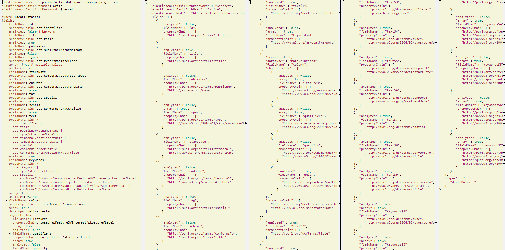

# Convert GraphDB Elastic index definition from YAML to JSON and embed in SPARQL
<!-- markdown-toc start - Don't edit this section. Run M-x markdown-toc-refresh-toc -->
**Table of Contents**

- [Convert GraphDB Elastic index definition from YAML to JSON and embed in SPARQL](#convert-graphdb-elastic-index-definition-from-yaml-to-json-and-embed-in-sparql)
    - [Intro](#intro)
    - [Features](#features)
    - [Usage](#usage)
    - [Example](#example)
        - [Example Specification](#example-specification)
        - [Example Conversion and Size Comparison](#example-conversion-and-size-comparison)
        - [Example YAML Input](#example-yaml-input)
        - [Example Expanded YAML](#example-expanded-yaml)
        - [Example SPARQL Update](#example-sparql-update)
    - [Caveats](#caveats)
    - [Prerequisites](#prerequisites)

<!-- markdown-toc end -->

## Intro

GraphDB has a powerful [Elasticsearch connector](https://graphdb.ontotext.com/documentation/10.8/elasticsearch-graphdb-connector.html) that allows you to specify which parts of a Knowledge Graph should be indexed in Elastic.
This is done by posting index definitions through the Workbench or using SPARQL Update.
The index definition is quite verbose:
- It's written in JSON, so you need to pay attention to a lot of quotes and braces.
- You cannot use prefixes in RDF props but have to specify the full URLs.
- You must write sequence property paths using JSON arrays
- You must write alternative paths by using [suffixed field names](https://graphdb.ontotext.com/documentation/10.8/elasticsearch-graphdb-connector.html#multiple-property-chains-per-field)
  and repeat all field characteristics between the suffixed variants.

## Features

The script [index-yaml-json-sparql.pl](index-yaml-json-sparql.pl) implements the following features:
- Expands prefixed RDF properties to full URLs using a file `prefixes.ttl`
- In `types`: should be a text field of prefixed RDF type URLss, separated by comma or space
  - Wraps it in a JSON array
- In `propertyChain`: should be a text field of prefixed property URLs, separated by `|` or `/`
  - Converts sequential paths spelled with `/` to JSON arrays of URLs
  - Converts alternative paths spelled with `|` to suffixed property definitions
    (`prop$1, prop$2, prop$3 ...`)
    and copies all characteristics from the original property
  - Supports objects nested up to 5 levels (see [Example](#example))
- Converts to JSON and wraps it in a SPARQL Update
- Replaces `elasticsearchBasicAuthPassword: $secret` with the value of `--secret=...`
- Replaces index instance name with the value of `--index=...`

Since GraphDB index definitions are more or less universal across connectors,
this script can also likely work with Lucene and SOLR connectors, but has not been tested.

## Usage
```
perl -S index-yaml-json-sparql.pl [options] input.yaml > output.ru

  Options (can abbreviate to first letter):
    --help       Print this help
    --version    Print version number and exit
    --prefixes=  Prefixes to use to expand RDf properties YAML (default prefixes.ttl)
    --secret=    Replace $secret in YAML (typically the value of elasticsearchBasicAuthPassword)
    --index=     Index instance name (default "index")
    --dump       Print internal data structure after YAML parsing for debugging
    --yaml       Print expanded YAML for debugging
    --json       Print JSON (by default, JSON is embedded in SPARQL)
```
Notes:
- The `-S` option looks for the script in your path.
- You can abbreviate options to the shortest unambiguous prefix and use single instead of double slash
- `.ru` is the extension for SPARQL Update

## Example

Let's look at an example from the EU [UNDERPIN project](https://underpinproject.eu/).
- `*` are multivalued fields.
- Fields are defined using prefixed RDF properties, and some use [SPARQL Property Paths](https://www.w3.org/TR/sparql11-query/#propertypaths)
  - All property paths start from `dcat:Dataset`
  - Sequence is shown as `/` and implemented as array in `propertyChain` (see [Creation parameters](https://graphdb.ontotext.com/documentation/10.8/elasticsearch-graphdb-connector.html#list-of-creation-parameters))
  - Disjunction is shown as `|` and implemented as [Multiple property chains per field](https://graphdb.ontotext.com/documentation/10.8/elasticsearch-graphdb-connector.html#elasticsearch-graphdb-connector-multiple-chains)
- Elastic fields are in lowercase and don't use a prefix
- Some fields reuse already defined fields (eg `keywords` uses RDF prop `dcat:keyword` and then reuses `tag, types` etc etc.
  Unfortunately [Copy fields](https://graphdb.ontotext.com/documentation/10.8/elasticsearch-graphdb-connector.html#copy-fields) can only reuse "**single element** in the property chain" so we can't use it with complex paths.

### Example Specification
We want to index the following fields.
- Facets:
  - `publisher`: `dct:publisher/schema:name`
  - `types`: `dct:type/skos:prefLabel`*
  - `startDate`: `dct:temporal/dcat:startDate`
  - `endDate`: `dct:temporal/dcat:endDate`
  - `tag`: `dct:spatial`
  - `schema`: `dct:conformsTo/dct:title`
  - `keywords`: `dcat:keyword|tag|types|features|qualifiers|quantity|unit`*
  - `columns` (nested object): `schema/csvw:column`
    - `features`: `sosa:hasFeatureOfInterest/skos:prefLabel`*
    - `qualifiers`: `un:qualifier/skos:prefLabel`*
    - `quantity`:  `qudt:hasQuantityKind/skos:prefLabel`
    - `unit`: `qudt:hasUnit/skos:prefLabel`
- Individual fields:
  - (builtin) `_id`: URL. This is automatically populated by GraphDB
  - `id`: `dct:identifier`
  - `title`: `dct:title`
- `text`: `id|title|publisher|types|startDate|endDate|tag|schema|dct:conformsTo/csvw:column/dct:title`

### Example Conversion and Size Comparison
Let's convert the example to several different formats
(in a real project you need only the first command):
```
perl index-yaml-json-sparql.pl --index=datasets        elastic-index.yaml > elastic-index.ru
perl index-yaml-json-sparql.pl --index=datasets --yaml elastic-index.yaml > elastic-index-expanded.yaml
perl index-yaml-json-sparql.pl --index=datasets --json elastic-index.yaml > elastic-index.json
```

We can compare the sizes with `wc elastic*`:
| line | word | char | file                        | comment                                 |
|------|------|------|-----------------------------|-----------------------------------------|
|   74 |  160 | 2203 | elastic-index.yaml          | Input YAML                              |
|  164 |  325 | 4607 | elastic-index-expanded.yaml | YAML with expanded prop URLs and chains |
|  256 |  464 | 7544 | elastic-index.json          | Same in JSON                            |
|  263 |  479 | 7781 | elastic-index.ru            | JSON wrapped in a SPARQL Update         |

You see how much smaller the input YAML is, and thus the savings in authoring and maintenance.
Here is a visual comparison of YAML (first column) vs JSON (the next 3 columns):



### Example YAML Input

The input [elastic-index.yaml](elastic-index.yaml) looks like this:
```yaml
elasticsearchNode: elastic:9200
elasticsearchBasicAuthUser: elastic
elasticsearchBasicAuthPassword: $secret

types: dcat:Dataset
fields:
  - fieldName: id
    propertyChain: dct:identifier
    analyzed: false # keyword
  - fieldName: title
    propertyChain: dct:title
    analyzed: true
  - fieldName: publisher
    propertyChain: dct:publisher/schema:name
    analyzed: false
  - fieldName: types
    propertyChain: dct:type/skos:prefLabel
    array: true # multiple values
    analyzed: false
  - fieldName: startDate
    propertyChain: dct:temporal/dcat:startDate
    analyzed: false
  - fieldName: endDate
    propertyChain: dct:temporal/dcat:endDate
    analyzed: false
  - fieldName: tag
    propertyChain: dct:spatial
    analyzed: false
  - fieldName: schema
    propertyChain: dct:conformsTo/dct:title
    analyzed: false
  - fieldName: text
    propertyChain: >-
      dct:identifier |
      dct:title |
      dct:publisher/schema:name |
      dct:type/skos:prefLabel |
      dct:temporal/dcat:startDate |
      dct:temporal/dcat:endDate |
      dct:spatial |
      dct:conformsTo/dct:title |
      dct:conformsTo/csvw:column/dct:title
    analyzed: true
  - fieldName: keywords
    propertyChain: >-
      dcat:keyword |
      dct:type/skos:prefLabel |
      dct:spatial |
      dct:conformsTo/csvw:column/sosa:hasFeatureOfInterest/skos:prefLabel |
      dct:conformsTo/csvw:column/un:qualifier/skos:prefLabel |
      dct:conformsTo/csvw:column/qudt:hasQuantityKind/skos:prefLabel |
      dct:conformsTo/csvw:column/qudt:hasUnit/skos:prefLabel
    array: true
    analyzed: false
  - fieldName: column
    propertyChain: dct:conformsTo/csvw:column
    array: true
    datatype: native:nested
    objectFields:
    - fieldName: features
      propertyChain: sosa:hasFeatureOfInterest/skos:prefLabel
      array: true
      analyzed: false
    - fieldName: qualifiers
      propertyChain: un:qualifier/skos:prefLabel
      array: true
      analyzed: false
    - fieldName: quantity
      propertyChain: qudt:hasQuantityKind/skos:prefLabel
      analyzed: false
    - fieldName: unit
      propertyChain: qudt:hasUnit/skos:prefLabel
      analyzed: false
```

- You can use comments
- `propertyChain` is the most complex field (note: it is just a large text field with newlines removed due to the `>-` marker).
  - Use prefixed RDF prop names
  - Sequence paths are separated with `/`
  - No need to worry whether there's 1 or multiple props in the path
  - Alternative paths are listed on lines separated with `|`
  - Unfortunately we cannot use [Copy fields](https://graphdb.ontotext.com/documentation/10.8/elasticsearch-graphdb-connector.html#copy-fields) (`@field` references) in this example
    because they support only single-valued property chains (i.e. a simple copy of an existing field).
    (The script does supports the `@field` notation)
- [Nested objects](https://graphdb.ontotext.com/documentation/10.8/elasticsearch-graphdb-connector.html#nested-objects) are supported (in this case `column` with `datatype: native:nested`).
  These are important if you need to track the correlation between nested fields

### Example Expanded YAML

Now let's look at a small piece of [elastic-index-expanded.yaml](elastic-index-expanded.yaml)
that corresponds to the `fieldName: keywords` above:
```yaml
- fieldName: keywords$1
  propertyChain:
  - http://www.w3.org/ns/dcat#keyword
  array: true
  analyzed: false
- analyzed: false
  propertyChain:
  - http://purl.org/dc/terms/type
  - http://www.w3.org/2004/02/skos/core#prefLabel
  array: true
  fieldName: keywords$2
- propertyChain:
  - http://purl.org/dc/terms/spatial
  analyzed: false
  fieldName: keywords$3
  array: true
- fieldName: keywords$4
  array: true
  propertyChain:
  - http://purl.org/dc/terms/conformsTo
  - http://www.w3.org/ns/csvw#column
  - http://www.w3.org/ns/sosa/hasFeatureOfInterest
  - http://www.w3.org/2004/02/skos/core#prefLabel
  analyzed: false
- array: true
  fieldName: keywords$5
  propertyChain:
  - http://purl.org/dc/terms/conformsTo
  - http://www.w3.org/ns/csvw#column
  - https://dataspace.underpinproject.eu/ontology/qualifier
  - http://www.w3.org/2004/02/skos/core#prefLabel
  analyzed: false
- array: true
  fieldName: keywords$6
  analyzed: false
  propertyChain:
  - http://purl.org/dc/terms/conformsTo
  - http://www.w3.org/ns/csvw#column
  - http://qudt.org/schema/qudt/hasQuantityKind
  - http://www.w3.org/2004/02/skos/core#prefLabel
- fieldName: keywords$7
  array: true
  analyzed: false
  propertyChain:
  - http://purl.org/dc/terms/conformsTo
  - http://www.w3.org/ns/csvw#column
  - http://qudt.org/schema/qudt/hasUnit
  - http://www.w3.org/2004/02/skos/core#prefLabel
```
- The field `keywords` is broken up into `keywords$1 .. keywords$7` that hold the 7 alternative paths.
  Field characteristics are replicated to these subfields.
- Prefixed RDF properties are expanded to full URLs

The corresponding JSON [elastic-index.json](elastic-index.json) is too large to show.

### Example SPARQL Update

The generated SPARQL [elastic-index.ru](elastic-index.ru) looks like this:
```sparql
PREFIX elastic:      <http://www.ontotext.com/connectors/elasticsearch#>
PREFIX elastic-inst: <http://www.ontotext.com/connectors/elasticsearch/instance#>
INSERT DATA {
  elastic-inst:datasets elastic:createConnector '''
{
   "elasticsearchBasicAuthPassword" : "$secret",
   "elasticsearchBasicAuthUser" : "elastic",
   "elasticsearchNode" : "elastic:9200",
   "fields" : [
...
   ],
   "types" : ["http://www.w3.org/ns/dcat#Dataset"]
}

''' .
}
```
You should use the `--secret` and `--index` options to customize respectively:
- `elasticsearchBasicAuthPassword` (assuming you use basic authentication from GraphDB to Elastic)
- the index instance URL (in this case `elastic-inst:datasets`)

## Caveats

- You cannot use full URLs in `propertyChain` because that conflicts with the syntax `/` for sequential path
- Property paths can use only single props, sequence `/` and alternative `|`. You cannot use parentheses
- Do not specify a trailing slash in `elasticsearchNode` or you'll get error
  `Option 'elasticsearchNode': Couldn't connect to Elasticsearch at <server>! Name or service not known`
- Use the `>-` YAML marker in `propertyChain` text to avoid stray newlines

## Prerequisites

The script is written in Perl and uses fairly standard modules (the last two come standard with Perl):
- Perl (tested with Strawberry 5.38.2)
- [Getopt::Long](https://metacpan.org/pod/Getopt::Long): Parse command-line options
- [YAML::PP](https://metacpan.org/pod/YAML::PP): Parse and print YAML
- [JSON::PP](https://metacpan.org/pod/JSON::PP): Print JSON
- [Data::Dumper](https://metacpan.org/pod/Data::Dumper): dump Perl internal data structure
- [Pod::Usage](https://metacpan.org/pod/Pod::Usage): print a help message from embedded documentation

You can install them with commands like this (depending on which Perl distribution you use)
```
cpanm Getopt::Long YAML::PP JSON::PP Data::Dumper Pod::Usage
cpan  Getopt::Long YAML::PP JSON::PP Data::Dumper Pod::Usage
```
